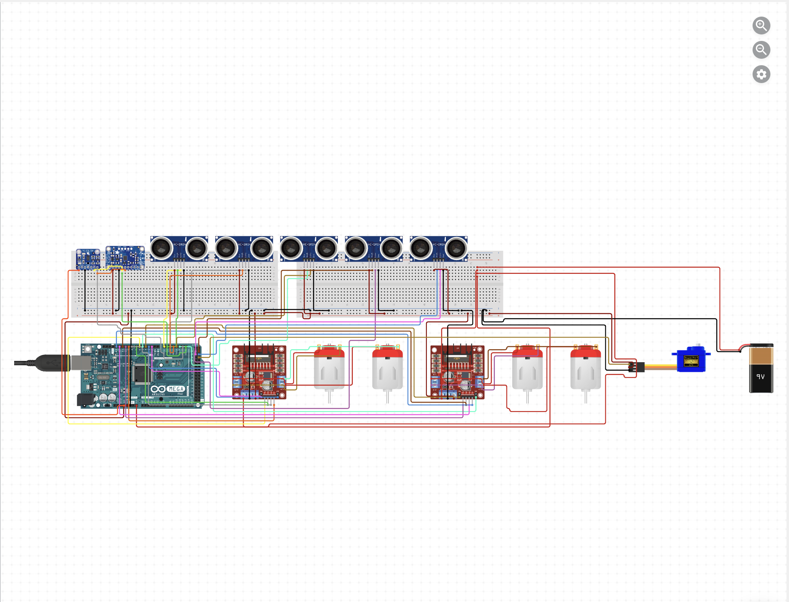

# Autonomous Rover with Sensor Fusion and Servo Claw

This project is an Arduino-based autonomous rover designed to detect and retrieve target objects using a combination of ultrasonic sensors, a gyroscope, and a servo-operated claw.

## 🔧 Hardware Overview

- **Microcontroller**: Arduino Mega 2560  
- **Motors**: 4x DC Motors with L298N Motor Drivers  
- **Sensors**:
  - 6x Ultrasonic Sensors (HC-SR04) for obstacle detection and wall following
  - Adafruit LSM303 Accelerometer + Magnetometer (compass and tilt sensing)
  - MPU6050 Gyroscope for orientation tracking
  - VL53L0X Time-of-Flight sensor for accurate object detection
- **Actuators**:
  - Servo motor (claw mechanism)
- **Power Supply**: 9V battery for motors, USB for Arduino logic

## ⚙️ Features

- Autonomous obstacle avoidance using ultrasonic range sensors
- Servo-controlled claw to grab detected objects
- Gyroscope-based correction for directional stability
- Modular code structure for sensor handling and movement control

## 🧠 Code Structure

- `finalrover.ino` – Main Arduino sketch containing:
  - Sensor calibration
  - Decision logic for obstacle response
  - Motor control and claw actuation

## 📌 Key Concepts

- Sensor fusion from multiple input devices (IMU + ToF + ultrasonic)
- Basic PID-style adjustments for stability (non-library based)
- Real-time environment scanning and path correction

## 🚀 Future Improvements

- Add PID control for more precise turns  
- Integrate SLAM/localisation (e.g., with encoder + compass)  
- Upgrade power system with voltage regulator + LiPo battery  

## 📸 Demo 

https://youtu.be/3H1Rzj9LXmA

---

## 🧾 License

MIT License
